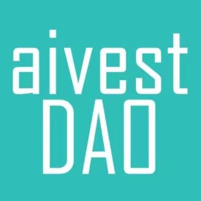

    

# Introduction of Aivest
[Aivest](https://www.aivestdao.com) is the First Decentralized Fair Launch App for AI Investment Models. For developers, feel free to hop on our [Discord](https://discord.com/invite/spuZSTUGbc) and reach out!

* **Pre-trained AI Investment Models** - Information AI and investment advisory AI are live at aivestdao.com, a simple frontend for visualization and code for training both regressors and classifiers. A contract implementing a mean-variance optimization and neural network for predicting best portfolio on chain. Feel free to fair launch your own tokenomic of AI investment models!

* **AlphaAI Model** - Aivest utilizes AI to comprehensively track users' investment behaviors, including acquiring new knowledge, secondary trading, market sentiment analysis, airdrops, etc. Ultimately, it forms a digital profile within the crypto industry for each user.

* **ZKML** - To protect your data and customized model, ZKML enables the validation of private data using public models or verifying private models with public data.

* **Fair Launch Contract of AI Model** - An EVM-compatible contract that allows AI prompt triggers for the token launch function of a specific AI model. Token distribution is conducted fairly, without pre-allocating this particular token to a selected group of users.

# Tools and  Papers

* [GPT model](https://openai.com) -  Generative Pre-trained Transformers, commonly known as GPT, are a family of neural network models that uses the transformer architecture and is a key advancement in artificial intelligence (AI) powering generative AI applications such as ChatGPT.

* [Langchain](https://www.langchain.com) - LangChain is a framework designed to simplify the creation of applications using large language models.

* [Streamlit](https://streamlit.io) - Streamlit is an open-source Python framework for machine learning and data science teams. 

* [RAG](https://arxiv.org/abs/2312.10997) - RAG synergistically merges LLMs' intrinsic knowledge with the vast, dynamic repositories of external databases.

* [PyPortfolioOpt](https://pyportfolioopt.readthedocs.io/en/latest/) - PyPortfolioOpt is a library that implements portfolio optimization methods, including classical efficient frontier techniques and Black-Litterman allocation.

* [Alpha-GPT](https://arxiv.org/pdf/2402.09746.pdf) - Alpha-GPT is a new paradigm for alpha mining in the realm of quantitative investment, developing a new interactive alpha mining system framework.

* [MarketSenseAI](https://arxiv.org/abs/2401.03737) -  MarketSenseAI is an innovative AI-driven framework for stock analysis and selection. Utilizing the advanced reasoning capabilities of GPT-4, MarketSenseAI effectively analyzes a diverse range of data, including company news, fundamentals, market dynamics, and macroeconomic information.

# Contact Us

* [https://www.aivestdao.com](https://www.aivestdao.com)

* [https://discord.com/invite/spuZSTUGbc](https://discord.com/invite/spuZSTUGbc)
